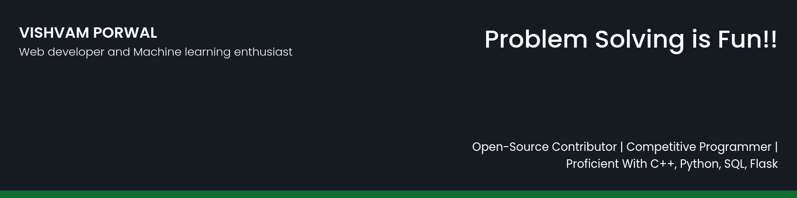

## 🧔 About Me

- 🔭 I’m currently working on [PharmAssist](https://github.com/VishvamPorwal/PharmAssist)

- 🌱 I’m currently learning **Machine Learning**

- 👯 I’m looking to collaborate on **Web development and Machine Learning Projects**

- 📫 Contact me **[here](vishvamporwal1@gmail.com)**

## ✍ My Work

Here are some of my projects on Github that I am proud of:

## 📚 My Skills

## 🤝 Connect

